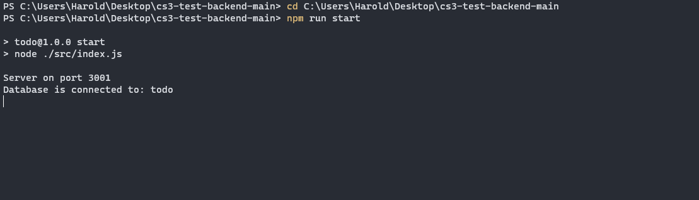

# cs3-test-backend# CS3 TEST App React

## Authors

- [@haroldmartinez10](https://github.com/haroldmartinez10)

## Run Locally

NOTE:

This application runs on node version v18.18.0

```bash
  npm install
```

Go to the project directory

```bash
  cd my-project
```

Install dependencies

```bash
  cd my-project
  npm install
```

Start the server

```bash
npm run start
```


